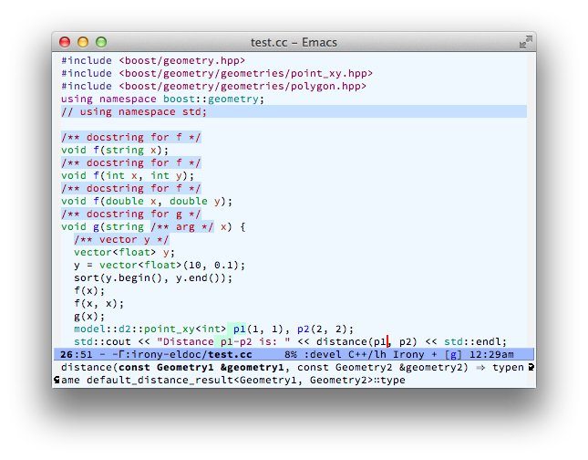

# irony-eldoc - irony-mode support for eldoc-mode

This implements eldoc support in irony-mode.  eldoc is a built-in
Emacs mode for displaying documentation about a symbol or function
call at point in the message buffer (see `eldoc-mode`).

## To use

Enable the minor mode `irony-eldoc`, as well as `eldoc-mode`. For
an example, place point on top of a symbol, or inside a function
call.

It is easiest to add `irony-eldoc` to `irony-mode-hook`, if you
already have `irony-mode` set up.

## Screenshot

## Notes

- It is based on irony-mode, which is in turn based on libclang. As a
  result, it avoid reparsing files when possible and is quite
  accurate.

- TODO It is a little imprecise when it comes to function calls:
  right now it resolves overloaded function calls by the number of
  arguments, but doesn't take arguments' types into account. It
  will show all matching functions in the minibuffer message, but
  that will include some irrelevant ones too. There is a plan to
  incorporate a precise version of this feature into `irony-mode`.
